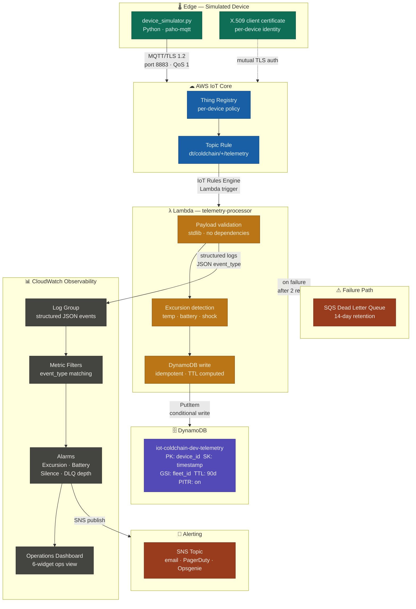

# AWS IoT Edge Reference — Cold Chain / Cargo Monitoring


---

## What this is

A production-pattern AWS IoT reference implementation for cold chain and cargo monitoring. It covers the full signal path: a Python device simulator publishing signed MQTT telemetry over mutual TLS, an AWS IoT Core topic rule routing to a Lambda processor, DynamoDB for time-ordered telemetry storage, and CloudWatch for operational visibility and excursion alerting.

This is a portfolio artifact, not a tutorial. The architecture decisions documented below reflect 14 years of enterprise IoT and cloud architecture work — the goal is to show *why* each design choice was made, not just that it runs. If you're evaluating patterns for a real cold chain deployment, the `docs/` directory has more depth. If you're a hiring manager skimming for signal, the Design Decisions section is where to spend your 90 seconds.

**Related work:**
- [`multicloud-sa-toolkit`](https://github.com/JamesIOmete/multicloud-sa-toolkit) — multi-cloud IaC reference, same deploy-and-teardown discipline
- [`tf-plan-ai-reviewer`](https://github.com/JamesIOmete/tf-plan-ai-reviewer) — AI-assisted Terraform plan review, used in this repo's CI workflow
- [`platformctl`](https://github.com/JamesIOmete/platformctl) — fleet management CLI; the Thing/policy structure here was designed to be consumed by a fleet management layer

---

## Architecture



Data flows one direction. The device has no inbound surface — no open ports, no polling endpoint, no management plane accessible from the device side. Commands and OTA updates (described in [Architecture Extensions](#architecture-extensions)) use a separate topic namespace and Device Shadow, not a callback into this flow.

See [`docs/architecture.md`](docs/architecture.md) for the full design decision record.

---

## Design decisions

### Why X.509 over API keys or Cognito

X.509 client certificates give each device a cryptographic identity that is independent of any shared secret. With API keys, compromise of one key is a fleet-wide event — you rotate the key and re-provision everything. With X.509, you revoke one certificate and the rest of the fleet is unaffected.

Mutual TLS (the device authenticates the broker *and* the broker authenticates the device) also eliminates a class of man-in-the-middle attacks that pre-shared key schemes don't address. For a cold chain deployment where telemetry authenticity has audit and compliance implications, that matters.

AWS IoT Core's certificate model maps cleanly to NIST SP 800-213 device identity guidance: each Thing gets its own certificate, each certificate gets a least-privilege policy scoped to its own topic prefix. This implementation pre-provisions certificates (realistic for a manufacturing line or provisioning station workflow); Just-in-Time Provisioning (JITP) is the logical next step at fleet scale.

### Why MQTT over HTTP

Cold chain sensors frequently run on constrained hardware over intermittent cellular links. MQTT's persistent session model means the broker queues messages while the link is down and delivers them when it re-establishes — HTTP polling can't do this without application-layer complexity. QoS 1 (at-least-once delivery) with the broker handling retransmission is far simpler than building retry logic into an HTTP client on a microcontroller.

MQTT also carries significantly less overhead per message — no HTTP headers, no TLS renegotiation on each request. For a device sending 10-second telemetry on a 2G link, this is the difference between viable and not.

This simulator uses `paho-mqtt` over TLS 1.2 on port 8883, which is the standard AWS IoT Core MQTT endpoint.

### Why DynamoDB for telemetry storage

The primary query pattern for cold chain telemetry is: *give me all readings for device X between time A and time B*. DynamoDB's composite key model (`device_id` as partition key, `timestamp` as sort key) covers this directly with a single Query operation — no scan, no secondary index needed for the hot path.

A dedicated time-series database (Timestream, InfluxDB) would give better compression and native downsampling at high volume, but adds operational overhead that isn't justified for this reference scope. The honest tradeoff: if you're ingesting >10M readings/day per device type with retention policies and rollup queries, revisit this. At the scale of a cargo monitoring fleet (hundreds to low thousands of devices, 6-10 readings/minute each), DynamoDB's write capacity and query performance are more than sufficient.

TTL is set to 90 days. A GSI on `fleet_id + timestamp` supports cross-device queries without a table scan.

### Why Lambda for the processor

Lambda is a natural fit here: the IoT Rules Engine triggers it directly, it scales to handle burst ingestion without pre-provisioning, and stateless ingestion is exactly what Lambda is good at. The processor validates the payload schema (Pydantic), detects threshold excursions, writes to DynamoDB, and emits structured logs to CloudWatch.

The DLQ (SQS) on Lambda failure means no telemetry is silently dropped if the processor errors — a critical property in a high-stakes monitoring system. Failed invocations are retried and eventually land in the DLQ for investigation.

At sustained high throughput (>1000 messages/second), the Lambda cold-start profile and per-invocation cost model would push toward a Kinesis Data Streams consumer with a dedicated processor. That's the right architectural fork point, and it's called out in the processor code.

### Why Terraform over CDK or SAM

Explicit resource model, readable plan output, and broad team familiarity. The `terraform plan` output is human-readable and reviewable in a pull request — the GitHub Actions workflow in this repo sends the plan to [`tf-plan-ai-reviewer`](https://github.com/JamesIOmete/tf-plan-ai-reviewer) for an automated review pass before any `apply`. CDK and SAM both generate CloudFormation, which is harder to review at a glance and less portable across teams.

Terraform's state model also makes teardown explicit and auditable, which matters when the goal is a clean deploy-and-destroy workflow for a portfolio or evaluation environment.

### Topic structure rationale

```
dt/coldchain/{device_id}/telemetry      # device telemetry (this repo)
cmd/{device_id}/request                 # commands inbound to device (extension pattern)
cmd/{device_id}/response                # command acknowledgment from device (extension pattern)
$aws/things/{thing_name}/shadow/...     # Device Shadow (extension pattern)
```

The `dt/` (device telemetry) prefix is a convention from AWS IoT documentation and is worth adopting — it makes topic-based IAM policies readable and gives you a clean namespace to separate telemetry from command traffic. Per-device policies are scoped to `dt/coldchain/${iot:ClientId}/*`, which means a device can only publish to its own topic. A compromised device cannot spoof telemetry for another device.

`#` (wildcard subscribe) in IoT policies is a fleet-wide blast radius. Don't use it in production.

---

## Repository structure

| Directory | Purpose |
|-----------|---------|
| `simulator/` | Python MQTT device simulator. Publishes cold chain telemetry using X.509 client cert authentication. Run this against a deployed stack to generate real data. |
| `terraform/` | All AWS infrastructure. IoT Core Thing + policy + rule, Lambda processor, DynamoDB table, CloudWatch alarms and dashboard. Structured for real deployability. |
| `lambda/` | Lambda processor source. Payload validation, excursion detection, DynamoDB write, structured logging. Packaged separately from Terraform for clarity. |
| `docs/` | Architecture decision record, deployment guide, and extension patterns (OTA, bi-directional commands, fleet management integration). |

---

## Prerequisites

- AWS account with credentials configured (`aws configure` or environment variables)
- Terraform ≥ 1.6
- Python 3.11+
- AWS CLI (for IoT certificate provisioning)
- An IoT Core Thing certificate provisioned — see [`simulator/certs/README.md`](simulator/certs/README.md) for the provisioning sequence

**Cost note:** Running this stack for a short evaluation is near-free. AWS IoT Core's free tier covers 500,000 messages/month. Lambda, DynamoDB, and CloudWatch costs for a test workload will be negligible (cents). Run `terraform destroy` when done.

---

## Deploy

```bash
# 1. Clone and configure
cp terraform/terraform.tfvars.example terraform/terraform.tfvars
# Edit terraform.tfvars: set aws_region, environment tag, alert email

# 2. Initialize and deploy
cd terraform
terraform init
terraform plan   # Review — the GitHub Actions workflow sends this to tf-plan-ai-reviewer
terraform apply

# 3. Note the outputs
terraform output  # IoT endpoint, DynamoDB table name, CloudWatch dashboard URL
```

Full deployment walkthrough including certificate provisioning and teardown: [`docs/deployment.md`](docs/deployment.md).

**Teardown:** `terraform destroy` removes all resources. The `certs/` directory is `.gitignored` — delete it manually when you're done.

---

## Run the simulator

```bash
cd simulator
pip install -r requirements.txt

# Configure — certs path and IoT endpoint from terraform output
export IOT_ENDPOINT="<your-endpoint>.iot.<region>.amazonaws.com"
export CERT_PATH="certs/device.pem.crt"
export KEY_PATH="certs/private.pem.key"
export CA_PATH="certs/AmazonRootCA1.pem"
export DEVICE_ID="cold-chain-sim-01"

python device_simulator.py
```

The simulator publishes a telemetry payload every 10 seconds. It models a realistic cold chain scenario: baseline temperature around 2–4°C with occasional drift, humidity variation, simulated shock events, and gradual battery drain. Temperature excursions (>8°C sustained) will trigger the CloudWatch alarm.

Expected output when connected and publishing:

```
[2024-01-15 09:23:41] Connected to IoT Core — cold-chain-sim-01
[2024-01-15 09:23:41] Published → dt/coldchain/cold-chain-sim-01/telemetry | temp: 3.2°C, hum: 68%, shock: 0.02g, bat: 94%
[2024-01-15 09:23:51] Published → dt/coldchain/cold-chain-sim-01/telemetry | temp: 3.5°C, hum: 67%, shock: 0.01g, bat: 94%
```

---

## Observability

The CloudWatch dashboard (URL in `terraform output`) shows:

- **Telemetry ingest rate** — messages/minute per device, Lambda invocation count
- **Temperature trend** — live readings from DynamoDB, excursion threshold line at 8°C
- **Error rate** — Lambda errors, DLQ depth (non-zero DLQ depth is a production alert)
- **Device heartbeat** — time since last message per device; silence >5 minutes triggers an alarm

**Alarms configured:**

| Alarm | Threshold | Intent |
|-------|-----------|--------|
| `TemperatureExcursion` | temp_c > 8.0 for 2 consecutive readings | Cold chain break — cargo at risk |
| `BatteryLow` | battery_pct < 15 | Device will go offline without intervention |
| `DeviceSilence` | No messages for 5 minutes | Device offline, link lost, or cert issue |
| `ProcessorErrors` | Lambda error rate > 0 | Indicates malformed payload or infrastructure issue |

Alarm actions send to an SNS topic. Wire in your email or PagerDuty endpoint via `terraform.tfvars`.

---

## Architecture extensions

These patterns are described at a design level. They represent the natural next layer of a production cold chain platform — the infrastructure structure in this repo was deliberately designed to accommodate them.

### OTA firmware updates

AWS IoT Jobs is the right delivery mechanism for OTA at fleet scale. The pattern:

1. New firmware artifact uploaded to S3 with a versioned prefix
2. IoT Job created targeting a Thing Group (e.g., all devices on firmware < 2.1.4)
3. Device receives job document via `$aws/things/{thing_name}/jobs/notify` — job document contains a pre-signed S3 URL valid for the download window
4. Device downloads, verifies checksum, applies update, reports success/failure via job execution update
5. Device Shadow `desired.firmware_version` / `reported.firmware_version` tracks fleet convergence

Why pre-signed S3 URLs rather than MQTT transfer: binary firmware is large, MQTT is optimized for small telemetry payloads, and S3 transfer is resumable. The pre-signed URL expires — the device must complete the download within the window, which enforces that only currently-provisioned devices can pull firmware.

Rollback strategy: maintain a `rollback_firmware_version` in the job document; devices that report failure revert to the previous known-good version automatically.

This repo's Thing Group structure (tagged by firmware version) was designed to support this targeting without rework.

### Bi-directional commands

The command topic pattern:

```
cmd/{device_id}/request   # cloud → device
cmd/{device_id}/response  # device → cloud
```

Key design considerations:
- **Idempotency:** Commands carry a `command_id` (UUID). The device deduplicates on `command_id` — receiving the same command twice should produce the same outcome, not a double action.
- **Acknowledgment:** The device publishes to `cmd/{device_id}/response` with `{command_id, status, timestamp}`. Lambda listens on the response topic and writes to DynamoDB. If no acknowledgment arrives within a configurable timeout, the command is marked failed and can be retried or escalated.
- **Shadow vs. direct message:** Use Device Shadow for state that must survive a device reconnect (set point changes, configuration). Use direct MQTT messages for transient commands (take a photo, run a self-test). The distinction matters: Shadow state persists in the broker; direct messages are fire-and-forget if the device is offline.

### Fleet management integration

[`platformctl`](https://github.com/JamesIOmete/platformctl) is a fleet management CLI designed to operate against a device registry structured like this repo's. The integration surface:

- Thing names follow `{fleet_id}-{device_type}-{serial}` convention — `platformctl` can query by fleet or device type without a separate index
- Thing attributes (firmware version, hardware revision, deployment region) are stored as IoT Core Thing attributes, making them queryable via `ListThings` with attribute filters
- The Lambda processor emits a structured log event per ingestion that includes `fleet_id`, enabling CloudWatch Logs Insights queries across a fleet without a separate metadata join

At 10k+ device scale, the `ListThings` API rate limits become a constraint. The right answer at that scale is a dedicated device registry (DynamoDB or Aurora) with IoT Core as the auth and message plane only — the Thing Registry becomes a certificate store, not a source of truth for device metadata.

---

## Security posture

**Implemented in this reference:**

- Per-device X.509 certificates — one certificate per Thing, independently revocable
- Least-privilege IoT policies — each device can publish only to its own topic prefix
- No credentials in code or Terraform state — certificate material lives in `simulator/certs/` (`.gitignored`); the Terraform `aws_iot_certificate` resource references certificate ARNs, not key material
- Lambda execution role scoped to specific DynamoDB table and CloudWatch log group ARNs
- DLQ on Lambda failure — no silent data loss

**Production hardening gaps (honest assessment):**

- AWS IoT Device Defender — continuous audit of IoT policies and device behavior anomalies; not configured here but the policy structure is audit-compatible
- AWS GuardDuty IoT threat detection — adds ML-based anomaly detection on MQTT patterns
- VPC endpoints for DynamoDB and CloudWatch — Lambda runs outside a VPC in this reference; a production deployment should pin Lambda to a VPC with private endpoints
- Certificate rotation lifecycle — this reference uses static certificates; production should implement automated certificate rotation using IoT Core's certificate renewal workflow
- Secrets Manager for any operational secrets — not applicable here, but relevant if you add a webhook or third-party integration to the SNS alarm actions

---

## Related work

- [`multicloud-sa-toolkit`](https://github.com/JamesIOmete/multicloud-sa-toolkit) — AWS, Azure, and GCP IaC reference implementations using the same deploy-and-teardown approach as this repo. UCx patterns tested on real cloud instances.
- [`tf-plan-ai-reviewer`](https://github.com/JamesIOmete/tf-plan-ai-reviewer) — Terraform plan AI review tool. The GitHub Actions workflow in `.github/workflows/terraform-plan.yml` integrates this for automated plan review on every PR.
- [`platformctl`](https://github.com/JamesIOmete/platformctl) — Fleet management CLI. The device naming conventions and Thing attribute schema in this repo were designed to be consumed by `platformctl`.

---

## License

MIT — see [LICENSE](LICENSE).

---

*James Ward · IoT & Cloud Solutions Architect · [LinkedIn](https://linkedin.com/in/james-ward-95a81a2/) · [GitHub](https://github.com/JamesIOmete)*
