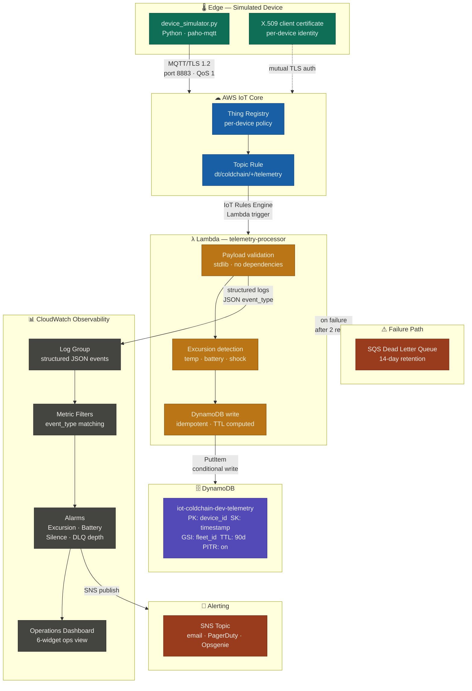

# Architecture

This document describes the design decisions behind the `aws-iot-edge-reference` implementation. It is written as an architecture decision record (ADR) — each decision is stated, the alternatives are named, and the reasoning is explicit.

---

## System diagram



---

## Data flow narrative

A device publishes a JSON telemetry payload to `dt/coldchain/{device_id}/telemetry` every 10 seconds over MQTT/TLS 1.2 on port 8883. The broker authenticates the device via its X.509 client certificate; the device authenticates the broker via the Amazon Root CA. No username or password is involved at any point.

IoT Core's rules engine matches the topic against the SQL filter `SELECT * FROM 'dt/coldchain/+/telemetry'` and triggers the Lambda processor synchronously. The `+` wildcard matches any single topic segment — all devices in the fleet route through the same rule to the same processor.

The Lambda processor validates the payload schema, detects threshold excursions, and writes the record to DynamoDB with a computed TTL. Every log line is a structured JSON object with an `event_type` field. CloudWatch metric filters match on `event_type` to increment custom metrics — the Lambda function never calls `PutMetricData` directly. This keeps the alarming logic decoupled from the processing logic and makes the metric history queryable independently of the function.

On Lambda failure, the event is retried twice by the async invocation model and then routed to the SQS DLQ. DLQ depth > 0 triggers a CloudWatch alarm. No telemetry is silently dropped.

---

## Design decisions

### Device identity: X.509 over API keys

X.509 client certificates give each device a cryptographic identity that is independent of any shared secret. With API keys, compromise of one key is a fleet-wide event. With X.509, you revoke one certificate and the rest of the fleet is unaffected.

Mutual TLS — the device authenticates the broker *and* the broker authenticates the device — eliminates a class of man-in-the-middle attacks that pre-shared key schemes cannot address. For cold chain monitoring where telemetry authenticity has audit and compliance implications, this matters.

AWS IoT Core's certificate model maps to NIST SP 800-213 device identity guidance: each Thing gets its own certificate, each certificate gets a least-privilege policy scoped to its own topic prefix. This implementation pre-provisions certificates, which reflects a realistic manufacturing-line or provisioning-station workflow. Just-in-Time Provisioning (JITP) is the logical extension at fleet scale.

**Alternatives considered:** Cognito identity pools (adds unnecessary complexity for device-to-cloud flows), custom authorizers (useful for brownfield devices that can't present certificates, not applicable here).

### Transport: MQTT over HTTP

Cold chain sensors frequently operate over intermittent cellular links. MQTT's persistent session model means the broker queues messages while the link is down and delivers them on reconnect — HTTP polling cannot do this without application-layer retry complexity. QoS 1 (at-least-once delivery) with broker-managed retransmission is simpler than building retry logic into an HTTP client on constrained hardware.

MQTT also carries significantly less per-message overhead — no HTTP headers, no TLS renegotiation per request. For a device publishing every 10 seconds on a 2G link, this is the difference between viable and not.

**Alternatives considered:** HTTPS with SigV4 (works, but no persistent session, no QoS, higher overhead), WebSockets (not appropriate for constrained devices).

### Topic structure

```
dt/coldchain/{device_id}/telemetry      # device telemetry — this implementation
cmd/{device_id}/request                 # commands inbound to device — extension pattern
cmd/{device_id}/response                # command acknowledgment — extension pattern
$aws/things/{thing_name}/shadow/...     # Device Shadow — extension pattern
```

The `dt/` prefix separates telemetry from command and shadow traffic at the policy level without per-resource ACLs. Per-device policies are scoped to `dt/coldchain/${iot:ClientId}/*` — a device can only publish to its own prefix. A compromised device cannot spoof another device's telemetry.

`#` wildcard in IoT policies is a fleet-wide blast radius. It is not used here.

### Storage: DynamoDB over a time-series database

The primary query pattern is: *give me all readings for device X between time A and time B*. DynamoDB's composite key — `device_id` as partition key, `timestamp` as sort key — covers this with a single Query operation. No scan, no secondary index on the hot path.

A dedicated time-series database (Amazon Timestream, InfluxDB) would give better compression and native downsampling at high volume, but adds operational overhead not justified at this reference scale. Honest tradeoff: at >10M readings/day per device type with retention policies and rollup queries, revisit this decision. At cold chain fleet scale (hundreds to low thousands of devices, 6-10 readings/minute each), DynamoDB's write capacity and query latency are more than sufficient.

TTL is set to 90 days — covers most regulatory audit windows for food and pharmaceutical cold chain. A GSI on `fleet_id + timestamp` supports cross-device fleet queries without a table scan.

**Alternatives considered:** Amazon Timestream (better compression, native time-series queries, justified at higher scale), S3 + Athena (cost-effective for analytical workloads, not appropriate for operational queries).

### Processor: Lambda over a stream consumer

Lambda is a natural fit for IoT Core rules engine integration: it scales to handle burst ingestion without pre-provisioning, and stateless per-message processing is exactly what Lambda is good at. The DLQ on failure means no telemetry is silently dropped.

The architectural fork point: at sustained high throughput (>1,000 messages/second), Lambda's per-invocation overhead and cold-start profile push toward a Kinesis Data Streams consumer with a dedicated processor. That decision point is documented in `handler.py`.

**Alternatives considered:** Kinesis Data Streams (right choice at high throughput, over-engineered here), IoT Core rules engine direct DynamoDB action (no validation, no excursion detection, no DLQ).

### Observability: metric filters over PutMetricData

The Lambda processor emits structured JSON log events with an `event_type` field. CloudWatch metric filters match on this field to increment custom metrics. The Lambda function never calls `PutMetricData` directly.

This decouples alarming logic from processing logic: the metric history exists in CloudWatch independently of the Lambda function version, adding a new metric requires only a new metric filter (not a code deploy), and CloudWatch Logs Insights can query the raw events directly for ad-hoc investigation.

**Alternatives considered:** Lambda calling PutMetricData directly (tighter coupling, requires code deploy to add metrics), embedded metrics format with AWS Lambda Powertools (good option, adds a dependency — stdlib-only approach preferred here for package size reasons).

### IaC: Terraform over CDK or SAM

Explicit resource model, human-readable plan output, and broad team familiarity. The `terraform plan` output is reviewable in a pull request — the GitHub Actions workflow sends it to `tf-plan-ai-reviewer` for an automated review pass before any `apply`. CDK and SAM both generate CloudFormation, which is harder to review at a glance.

Terraform's state model makes teardown explicit and auditable, which matters for a portfolio or evaluation deployment that must be cleanly removed after testing.

---

## Security posture

**Implemented:**
- Per-device X.509 certificates — one per Thing, independently revocable
- Least-privilege IoT policies — each device publishes only to its own topic prefix
- No credentials in code or Terraform state — certificate material is `.gitignored`
- Lambda execution role scoped to specific DynamoDB table and log group ARNs
- DLQ on Lambda failure — no silent data loss
- DynamoDB server-side encryption and point-in-time recovery enabled

**Production hardening gaps:**
- AWS IoT Device Defender — continuous audit of IoT policies and device behaviour anomalies
- AWS GuardDuty IoT threat detection — ML-based anomaly detection on MQTT patterns
- VPC endpoints for DynamoDB and CloudWatch — Lambda runs outside a VPC in this reference
- Certificate rotation lifecycle — static certificates here; production should implement automated rotation
- Secrets Manager for any operational secrets added to the SNS alarm action chain
